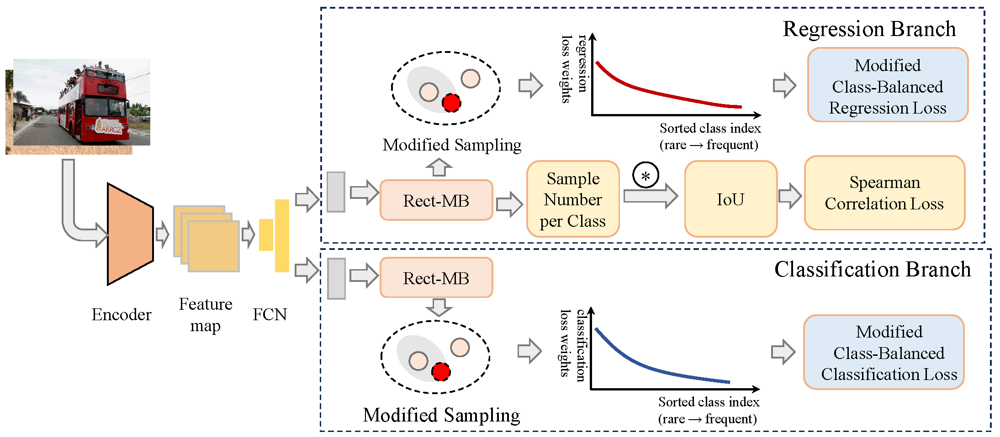

# Rectify the Matching Bias for Dense Long-Tailed Object Detection
This is the official repository for **Rectify the Matching Bias for Dense Long-Tailed Object Detection**.


## Installation
Tested on Ubuntu 18.04, CUDA 12.1, Pytorch 1.8.1
```shell
conda create -n rect-mb python=xx.xx
conda activate rect-mb
pip install -r requirments
 ```

## Data Preparation
Please follow the guide of United-Perception to prepare the LVIS 1.0 and COCO-LT datasets. 

## Train
Step1: edit meta_file and image_dir of image_reader:
```yaml
dataset: # Required.
  train:
    dataset:
      type: cls
      kwargs:
        meta_file: /mnt/lustre/share/images/meta/train.txt
        image_reader:
           type: fs_pillow
           kwargs:
             image_dir: /mnt/lustre/share/images/train
             color_mode: RGB
             ...
  test:
    dataset:
      type: cls
      kwargs:
        meta_file: /mnt/lustre/share/images/meta/val.txt
        image_reader:
          type: fs_pillow
          kwargs:
            image_dir: /mnt/lustre/share/images/val
            color_mode: RGB
            ...

```
Step2: train

```shell
python -m eod train --config configs/det/efl/efl_improved_baseline_r50_2x_rfs.yaml --nm 1 --ng 2 --launch pytorch 2>&1 | tee log.train_r50  
```
* --config: yamls in configs/
* --nm: machine number
* --ng: gpu number for each machine
* --launch: slurm or pytorch

## Eval
Step1: edit config of evaluating dataset

Step2: test

```shell
python -m eod train -e --config configs/det/efl/efl_improved_baseline_r50_2x_rfs.yaml  --nm 1 --ng 1 --launch pytorch 2>&1 | tee log.test_r50
```
* --config: yamls in configs/
* --nm: machine number
* --ng: gpu number for each machine
* --launch: slurm or pytorch
